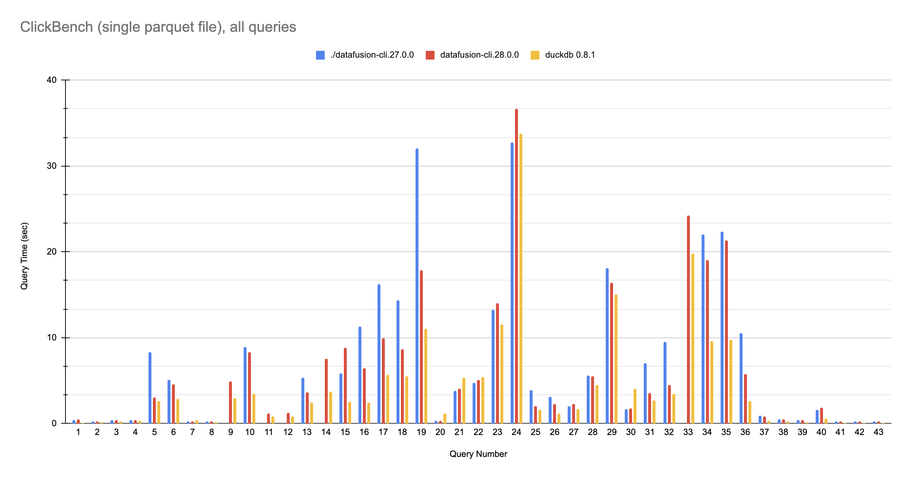

# ClickBench: DataFusion / DuckDB comparision scripts

This benchmark compares DataFusion 34.0.0 and 25.0.0 performance with the  [ClickBench](https://github.com/ClickHouse/ClickBench) queries aganst the unmodified ClickBench parquet files.

# Results



Raw data is in [result.csv](result.csv) See [Google Sheet] for source data

[Google Sheet]: https://docs.google.com/spreadsheets/d/1FtI3652WIJMC5LmJbLfT3G06w0JQIxEPG4yfMafexh8/edit#gid=530035076

## Versions
* DataFusion 25.0.0
* DataFusion 34.0.0

## Scenarios
* Single parquet file (hits.parquet)

## Download Data:
```shell
bash setup.sh
```

## Install DataFusion-CLI

Install from crates.io:
```shell
cargo install datafusion-cli --version 28.0.0
```

Or build from source

```shell
git clone https://github.com/apache/arrow-datafusion.git
cd datafusion
cargo install --path datafusion-cli
```

## Run queries
queres are run with `run-datafusion.sh`

DuckDB:
```shell
CREATE=create-single-duckdb.sql bash run-duckdb.sh
```

DataFusion
```shell
DATAFUSION_CLI=./datafusion-cli.413eba1 CREATE=create-single-datafusion.sql bash run-datafusion.sh
```

More examples in [benchmark.sh](benchmark.sh)

# Results
Results are written into [`result.csv`](result.csv)


## Python Example

The example python script is [hash.py](hash.py)

```shell
python3 hash.py
```
